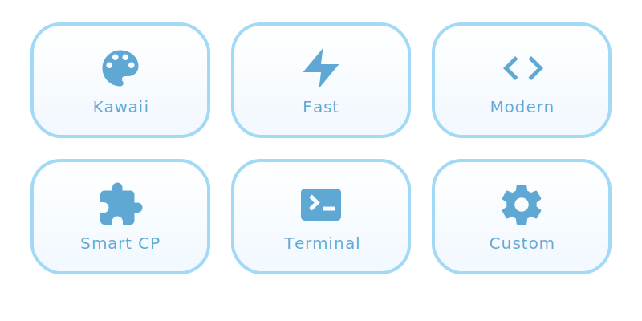

<div align="center">
  <br />
  
  <br />

  # 🦈 Sameko IDE ⚓
  
  **The cutest & fastest C++ IDE for your coding adventures! (≧◡≦) ♡**
  
  <p>
    <a href="https://github.com/QuangquyNguyenvo/IDE-Project">
      
    </a>
    
    
  </p>
</div>

<br />

<div align="center">
  ★ 。＼｜／。★
  <br/>
  <b>Welcome to the deep blue sea of coding! 🌊</b>
  <br/>
  ★ 。／｜＼。★
</div>

<br />

<div align="center">
  
</div>

<br />

## 🫧 Introduction (o^▽^o)

**Sameko IDE** is a super adorable environment for C++ development! Designed with a **"Kawaii Ocean"** aesthetic, it brings the calm and charm of the sea directly to your workflow. 

Whether you are a competitive programmer or just saying "Hello World", Sameko helps you swim through problems with speed and style! 💙

<div align="center">
  <p><i>"Code like a shark, sleep like a cat! ~ Nya!"</i></p>
</div>

<br />

## ✨ Features (ﾉ◕ヮ◕)ﾉ*:･ﾟ✧

<div align="center">
  
</div>

<br />

## 📸 Snapshots (* >ω<)

<div align="center">
  
  <!-- Welcome Screen View -->
  

  <!-- Main Editor View -->
  
</div>

<br />

<br />

## ⚓ Getting Started ⸜(｡˃ ᵕ ˂ )⸝♡

Ready to dive in? Follow these simple steps to set up your ocean base!

### Prerequisites
*   **Node.js** (v18+)
*   **A love for sharks and cute things** (Super important!) 💙

### Installation

1.  **Clone the treasure map**
    ```bash
    git clone https://github.com/QuangquyNguyenvo/IDE-Project.git
    cd IDE-Project
    ```

2.  **Summon the crew (Install dependencies)**
    ```bash
    npm install
    ```

3.  **Set sail! (Run the app)** ⛵
    ```bash
    npm start
    ```

<br />

<br />

## ⌨️ Shortcuts (English Keyboard)

|     Key      | Action ⚓          |
| :----------: | :---------------- |
|     `F9`     | **Compile**       |
|    `F10`     | **Run**           |
|    `F11`     | **Compile & Run** |
| `Ctrl` + `N` | New Page          |
| `Ctrl` + `J` | Toggle Panel      |

<br />

<br />

## 🤝 Join the Crew (´• ω •`)

We love new friends! If you want to make **Sameko IDE** even better:

1.  Fork the repo
2.  Create a branch (`git checkout -b feature/CoolFeature`)
3.  Commit your changes
4.  Push to the branch
5.  Open a Pull Request

Check out [CONTRIBUTING.md](CONTRIBUTING.md) for more details!

<br />

## 📜 License

This project is protected under the **MIT License**. Free as the ocean! 🌊

<br />

<div align="center">
  <p>Made with 💙 and 🦈 by <b>QuangquyNguyenvo</b></p>
  <p><i>"Have a bubbly day!"</i></p>
</div>


