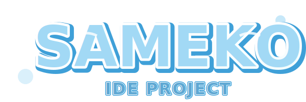
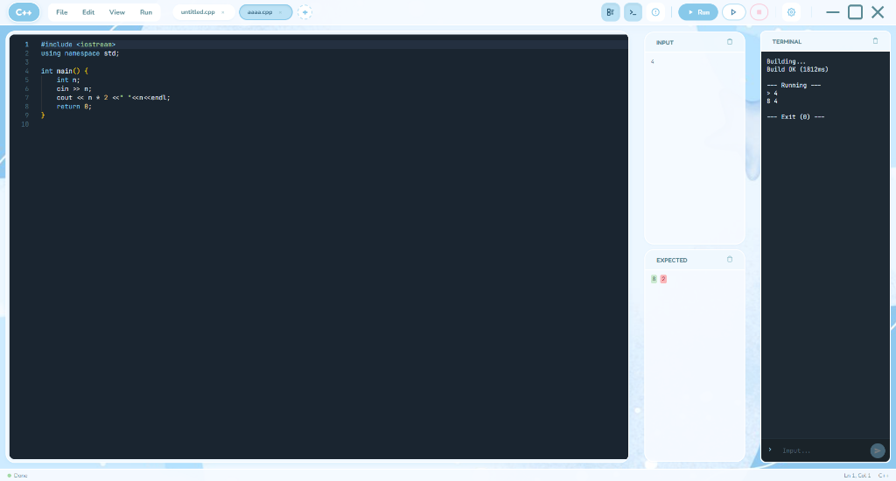

<div align="center">
  <br />
  
  <br />

  # 🐟 Sameko IDE ⚓
  
  **The cutest & fastest C++ IDE for your coding adventures! (≧◡≦) ♡**
  
  <p>
    <a href="https://github.com/QuangquyNguyenvo/IDE-Project">
      
    </a>
    
    
  </p>
</div>

<br />

<div align="center">
  ★ 。＼｜／。★
  <br/>
  <b>Welcome to the deep blue sea of coding! 🌊</b>
  <br/>
  ★ 。／｜＼。★
</div>

<br />

<div align="center">
  
</div>

<br />

## 🫧 Introduction (o^▽^o)

**Sameko IDE** is a super adorable C++ development environment! Designed with a **"Kawaii Ocean"** aesthetic 🌊, Sameko brings the calm and charm of the sea directly to your coding workflow.

Whether you're a competitive programmer or just starting with "Hello World", Sameko helps you swim through problems with speed and style! 💙

<div align="center">
  <p><i>"Swim through code like a fish in the sea~ 🐟"</i></p>
</div>

<br />

## ✨ Features ･ﾟ✧

|                             |                                                             |
| :-------------------------- | :---------------------------------------------------------- |
| ✦ **Run without saving**    | Press F11 to compile & run, no save needed                  |
| ✦ **TDM-GCC included**      | No compiler setup, just download and code                   |
| ✦ **Multi-tab & Split**     | Multiple files, drag to reorder, split view                 |
| ✦ **Competitive Companion** | Auto-fetch tests from CF, AtCoder, LeetCode                 |
| ✦ **6 themes**              | Kawaii Light, Kawaii Dark, Dracula, Monokai, Nord, One Dark |
| ✦ **Customizable**          | Backgrounds, C++11/14/17/20, compiler flags                 |

<br />

## 📸 Screenshots (* >ω<)

<div align="center">
  
  <!-- Welcome Screen -->
  

  <!-- Editor -->
  

</div>

<br />

## ⚓ Getting Started ⸜(｡˃ ᵕ ˂ )⸝♡

### Prerequisites
*   **Node.js** (v18+)
*   **A love for fish and cute things** 🐟

### Installation

1.  **Clone the repo**
    ```bash
    git clone https://github.com/QuangquyNguyenvo/IDE-Project.git
    cd IDE-Project
    ```

2.  **Install dependencies**
    ```bash
    npm install
    ```

3.  **Run the app** ⛵
    ```bash
    npm start
    ```

<br />

## ⌨️ Shortcuts

|              |               |
| :----------- | :------------ |
| ✦ `F9`       | Compile       |
| ✦ `F10`      | Run           |
| ✦ `F11`      | Compile & Run |
| ✦ `Ctrl + N` | New file      |
| ✦ `Ctrl + J` | Toggle Panel  |
| ✦ `Ctrl + \` | Split Editor  |
| ✦ `Ctrl + S` | Save file     |

<br />

## 🤝 Contributing (´• ω •`)

We welcome contributions to make Sameko even better! Fork the repo and submit a PR~
Check out [CONTRIBUTING.md](CONTRIBUTING.md) for more details!

<br />

## 📜 License

This project is protected under the **MIT License**. Free as the ocean! 🌊

<br />

<div align="center">
  <p>Made with 💙 and 🐟 by <b>QuangquyNguyenvo</b></p>
  <p><i>"Have a bubbly day!"</i></p>
</div>


